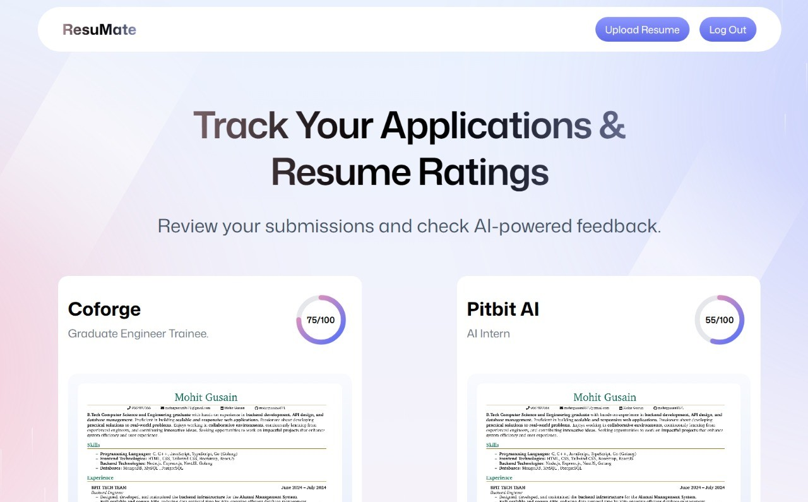

<div align="center">
  <br />
    

  <br />

  <div>
    
        
        
    
  </div>

  <h3 align="center">ResuMate -  An AI Resume Analyzer</h3>

</div>

## 📋 <a name="table">Table of Contents</a>

1. ✨ [Introduction](#introduction)
2. ⚙️ [Tech Stack](#tech-stack)
3. 🔋 [Features](#features)
4. 🤸 [Quick Start](#quick-start)
5. 🔗 [Assets](#links)

## <a name="introduction">✨ Introduction</a>

I built an AI-driven Resume Analyzer using React, React Router, and Puter.js. The app lets users seamlessly authenticate, upload their resumes, and get intelligent feedback based on job descriptions. It uses AI to evaluate resume quality, provide custom suggestions, and generate ATS (Applicant Tracking System) scores—making job matching smarter and more personalized.

If you need assistance or find any bug feel free to reach me.

[](https://www.linkedin.com/in/mohit-gusain-9b687a257/) 
[](mailto:mohitgusain8671@gmail.com) 


## <a name="tech-stack">⚙️ Tech Stack</a>

- **[React](https://react.dev/)** is a popular open‑source JavaScript library for building user interfaces using reusable components and a virtual DOM, enabling efficient, dynamic single-page and native apps.

- **[React Router v7](https://reactrouter.com/)** is the go‑to routing library for React apps, offering nested routes, data loaders/actions, error boundaries, code splitting, and SSR support—all with a smooth upgrade path from v6.

- **[Puter.com](https://puter.com/)** is an advanced, open-source internet operating system designed to be feature-rich, exceptionally fast, and highly extensible. Puter can be used as: A privacy-first personal cloud to keep all your files, apps, and games in one secure place, accessible from anywhere at any time.

- **[Puter.js](https://developer.puter.com/)** is a tiny client‑side SDK that adds serverless auth, storage, database, and AI (GPT, Claude, DALL·E, OCR…) straight into your browser app—no backend needed and costs borne by users.

- **[Tailwind CSS](https://tailwindcss.com/)** is a utility-first CSS framework that allows developers to design custom user interfaces by applying low-level utility classes directly in HTML, streamlining the design process.

- **[TypeScript](https://www.typescriptlang.org/)** is a superset of JavaScript that adds static typing, providing better tooling, code quality, and error detection for developers, making it ideal for building large-scale applications.

- **[Vite](https://vite.dev/)** is a fast build tool and dev server using native ES modules for instant startup, hot‑module replacement, and Rollup‑powered production builds—perfect for modern web development.

- **[Zustand](https://github.com/pmndrs/zustand)** is a minimal, hook-based state management library for React. It lets you manage global state with zero boilerplate, no context providers, and excellent performance through selective state subscriptions.

## <a name="features">🔋 Features</a>

👉 **Easy & convenient auth**: Handle authentication entirely in the browser using Puter.js—no backend or setup required.

👉 **Resume upload & storage**: Let users upload and store all their resumes in one place, safely and reliably.

👉 **AI resume matching**: Provide a job listing and get an ATS score with custom feedback tailored to each resume.

👉 **Reusable, modern UI**: Built with clean, consistent components for a great-looking and maintainable interface.

👉 **Code Reusability**: Leverage reusable components and a modular codebase for efficient development.

👉 **Modern UI/UX**: Clean, responsive design built with Tailwind CSS and shadcn/ui for a sleek user experience.

## <a name="quick-start">🤸 Quick Start</a>

Follow these steps to set up the project locally on your machine.

**Prerequisites**

Make sure you have the following installed on your machine:

- [Git](https://git-scm.com/)
- [Node.js](https://nodejs.org/en)
- [npm](https://www.npmjs.com/) (Node Package Manager)

**Cloning the Repository**

```bash
git clone https://github.com/mohitgusain8671/AI-RESUME-ANALYZER.git
cd AI-RESUME-ANALYZER
```

**Installation**

Install the project dependencies using npm:

```bash
npm install
```

**Running the Project**

```bash
npm run dev
```

Open [http://localhost:5173](http://localhost:5173) in your browser to view the project.